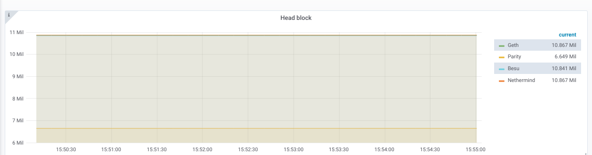

## Node monitor

This is a little tool to keep track on a set of nodes, 
and see if they keep in step or if they go out of consensus. 

## Usage
1. Copy the `config.example.toml` into a `config.toml` file and fill in the required information
2. with Docker: `docker run -d --name nodemonitor -p 8080:8080 -v <path-to-config.toml>/config.toml:/config.toml holiman/nodemonitor:latest /config.toml`
3. Access the webpage by navigating to `http://localhost:8080`

## Dashboard

It shows a neat little dashboard, where 'interesting' points of differing opinions are shown: 

## Metrics

It also has support for pushing metrics to `influxdb`, so you can get nice charts and 
alerts from all/any node which supports basic set of standard rpc methods. 

