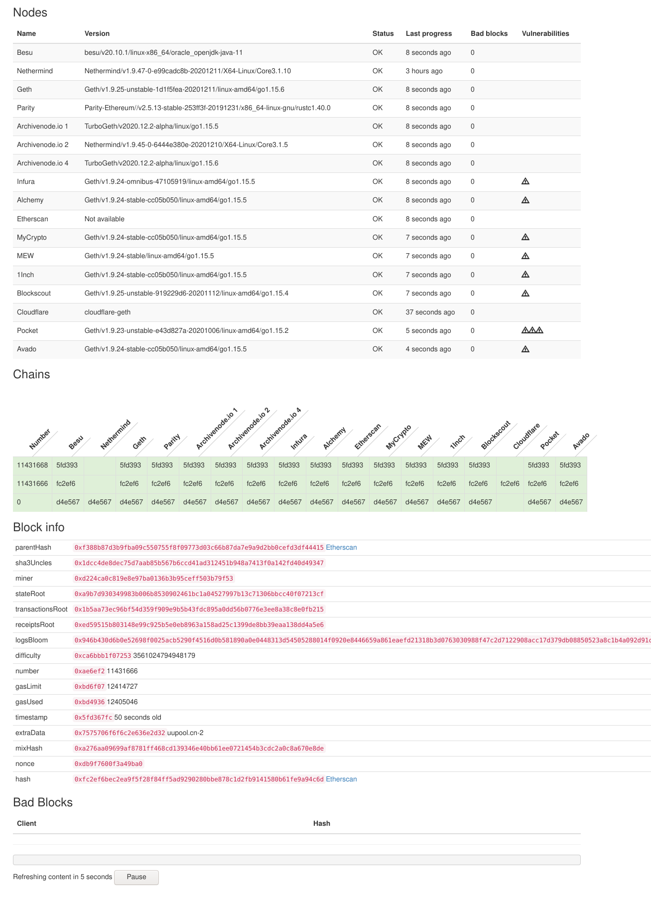

## Node monitor

This is a little tool to keep track on a set of nodes, 
and see if they keep in step or if they go out of consensus. 

## Dashboard

It shows a neat little dashboard, where 'interesting' points of differing opinions are shown: 

## Metrics

It also has support for pushing metrics to `influxdb`, so you can get nice charts and 
alerts from all/any node which supports basic set of standard rpc methods. 

